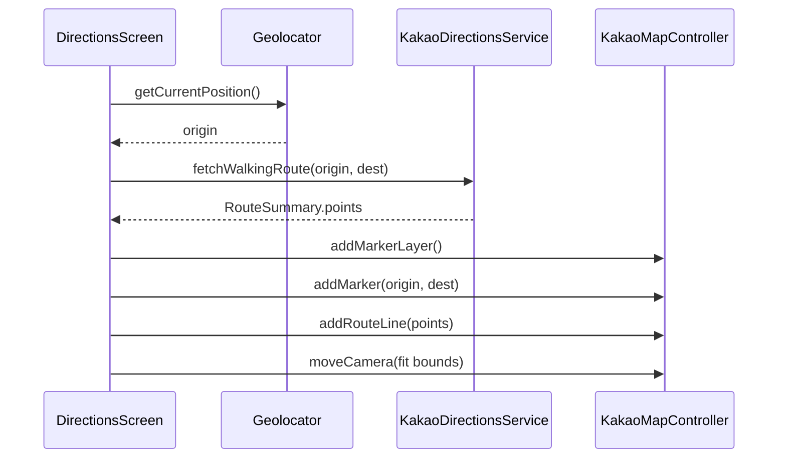

# 길찾기 Polyline 구현 가이드

앱 내 **길찾기** 화면(`DirectionsScreen`)에서 **현재 위치 → 식당** 도보 경로를 카카오맵 위에 선(polyline)으로 그리는 방법입니다.

> **구현 상태 (2026-06):** CustomPaint 오버레이 방식으로 **1차 구현 완료**  
> - `lib/widgets/route_polyline_overlay.dart` — 지도 위 경로선  
> - `lib/utils/map_camera_helper.dart` — 경로 bounds 카메라 맞춤  
> - `lib/screens/directions_screen.dart` — Stack 연동  
> - `lib/services/kakao_directions_service.dart` — 도보 API(제휴) + 자동차 fallback  

---

## 1. 현재 상태 (2026-06 기준)

| 구간 | 상태 | 파일 |
|------|------|------|
| 길찾기 진입 | ✅ | `lib/utils/navigation_helper.dart` → `DirectionsScreen` |
| 현재 위치 취득 | ✅ | `geolocator` (`directions_screen.dart`) |
| 경로 API 호출 | ✅ (부분) | `lib/services/kakao_directions_service.dart` |
| 경로 좌표 파싱 | ✅ | `RouteSummary.points` (`List<MapLatLng>`) |
| 지도 + 마커 | ✅ | `directions_screen.dart` (출발/도착 마커) |
| **Polyline 렌더링** | ✅ (CustomPaint) | `lib/widgets/route_polyline_overlay.dart` |
| 카카오맵 앱 연동 | ✅ | `lib/utils/kakao_map_launcher.dart` |

### 이미 갖춰진 것

`KakaoDirectionsService.fetchWalkingRoute()`는 API 응답의 `sections[].roads[].vertexes`를 파싱해 **`RouteSummary.points`** 로 반환합니다. Polyline을 그리려면 **렌더링 레이어만 추가**하면 됩니다.

```dart
// RouteSummary — 이미 존재
class RouteSummary {
  final List<MapLatLng> points;  // ← polyline 꼭짓점
  final String distanceText;
  final String durationText;
}
```

---

## 2. 핵심 제약: `kakao_maps_flutter`에 Polyline API 없음

사용 중인 플러그인 [`kakao_maps_flutter` ^0.1.2](https://pub.dev/packages/kakao_maps_flutter)는 **마커·카메라·POI**만 지원하고, **RouteLine / Polyline API는 Dart에 노출되어 있지 않습니다.**

카카오 네이티브 SDK 자체는 지원합니다.

| 네이티브 API | 용도 | 문서 |
|-------------|------|------|
| **RouteLine** (Android) / **Route** (iOS) | 길찾기 경로 (LOD 최적화, **권장**) | [Android RouteLine](https://apis.map.kakao.com/android_v2/docs/api-guide/routeline/) · [iOS Route](https://apis.map.kakao.com/ios_v2/docs/map/07_route/) |
| **Polyline** | 정적 선형 (경로용 비권장) | [Android Polyline](https://apis.map.kakao.com/android_v2/docs/api-guide/shape/polyline/) |

→ **Polyline을 앱 지도 위에 그리려면 아래 3가지 중 하나를 선택**해야 합니다.

---

## 3. 구현 옵션 비교

| 옵션 | 난이도 | 품질 | iOS/Android | 추천 |
|------|--------|------|-------------|------|
| **A. 플러그인에 RouteLine 추가** | 높음 | ⭐⭐⭐ | 동일 UX | **장기 권장** |
| **B. Flutter CustomPaint 오버레이** | 중간 | ⭐⭐ | 카메라 이동 시 재계산 필요 | 빠른 PoC |
| **C. 카카오맵 앱만 사용** | 낮음 | ⭐⭐⭐ | 외부 앱 | 이미 구현됨 |

---

## 4. 권장 아키텍처 (옵션 A)

```
[길찾기 버튼]
    ↓
DirectionsScreen._loadRoute()
    ↓
Geolocator → 현재 위치 (origin)
    ↓
KakaoDirectionsService.fetchWalkingRoute(origin, destination)
    ↓
RouteSummary { points[], distanceText, durationText }
    ↓
KakaoMapController.addRouteLine(...)   ← 신규 API (플러그인 확장)
    ↓
카메라 fitBounds(origin + destination + padding)
```

### mermaid — 데이터 흐름



---

## 5. Step 0 — 경로 API 점검 (Polyline 전에 필수)

현재 `kakao_directions_service.dart`는 **자동차 길찾기** 엔드포인트를 사용합니다.

```
GET https://apis-navi.kakaomobility.com/v1/directions
```

캠퍼스 **도보** 길찾기에는 아래 중 하나가 더 적합합니다.

| API | URL | 비고 |
|-----|-----|------|
| 자동차 (현재) | `/v1/directions` | 단거리·보행로에서 부정확할 수 있음 |
| **도보 (제휴)** | `/affiliate/walking/v1/directions` | [Kakaomobility 제휴 신청](https://developers.kakaomobility.com/) 필요, `service` 헤더 필요 |

### 도보 API 전환 체크리스트

1. [Kakaomobility Developers](https://developers.kakaomobility.com/)에서 **Walking Directions API** 제휴/활성화
2. `KAKAO_REST_API_KEY`에 모빌리티 권한 확인
3. `fetchWalkingRoute()` URL·헤더 변경:

```dart
// 변경 예시 (제휴 도보 API)
final uri = Uri.https(
  'apis-navi.kakaomobility.com',
  '/affiliate/walking/v1/directions',
  {
    'origin': '${origin.longitude},${origin.latitude}',
    'destination': '${destination.longitude},${destination.latitude}',
    'priority': 'DISTANCE',
    'summary': 'false',  // sections/vertexes 포함
  },
);

final res = await http.get(uri, headers: {
  'Authorization': 'KakaoAK $key',
  'service': 'campuslunch',  // 제휴 시 발급받은 service 이름
});
```

4. 응답 파싱(`vertexes`)은 **현재 코드와 동일** — `sections → roads → vertexes` 구조 유지
5. API 실패 시 기존처럼 `estimateStraightWalkingRoute()` fallback (직선 2점)

> 제휴 API 없이 당장 PoC만 할 경우: 현 `/v1/directions` + `points` 파싱으로 polyline 형태 확인은 가능합니다.

---

## 6. Step 1 — 플러그인 RouteLine API 설계 (옵션 A)

프로젝트 내 `packages/kakao_maps_flutter` 포크를 두거나, upstream PR 전까지 **로컬 패치**를 권장합니다.

### 6-1. Dart API (추가할 인터페이스)

```dart
// lib/src/data/route/route_line_option.dart (신규)
class RouteLineOption {
  const RouteLineOption({
    required this.id,
    required this.points,       // List<LatLng>
    this.styleId = 'route_walk',
    this.lineColor = 0xFF4C9C2A,
    this.lineWidth = 6,
    this.zOrder = 0,
  });

  final String id;
  final List<LatLng> points;
  final String styleId;
  final int lineColor;   // ARGB
  final int lineWidth;
  final int zOrder;
}

// KakaoMapController 확장
Future<void> registerRouteLineStyles({ required List<RouteLineStyle> styles });
Future<void> addRouteLine({ required RouteLineOption option });
Future<void> removeRouteLine({ required String id });
Future<void> clearRouteLines();
```

### 6-2. Android (RouteLineLayer)

[Kakao Android RouteLine 가이드](https://apis.map.kakao.com/android_v2/docs/api-guide/routeline/) 참고:

1. `RouteLineManager` / `RouteLineLayer` 획득
2. `RouteLineStylesSet` 등록 (lineColor, lineWidth, strokeColor)
3. `RouteLineSegment` + `MapPoints.fromLatLng(...)` 로 경로 추가
4. MethodChannel: `registerRouteLineStyles`, `addRouteLine`, `removeRouteLine`

### 6-3. iOS (RouteLayer)

[iOS Route 가이드](https://apis.map.kakao.com/ios_v2/docs/map/07_route/) 참고:

1. `RouteManager`로 `RouteStyleSet` 등록
2. `RouteLayer` 생성
3. `RouteSegment` 배열 + `MapPoint` 좌표로 `addRoute`
4. 동일 MethodChannel 메서드명 유지 (Android/iOS 공통)

### 6-4. pubspec 연결

```yaml
dependencies:
  kakao_maps_flutter:
    path: packages/kakao_maps_flutter   # 포크 경로
```

---

## 7. Step 2 — `DirectionsScreen` 연동

수정 대상: `lib/screens/directions_screen.dart`

### 7-1. `_setupMap()` 확장 순서

```dart
Future<void> _setupMap() async {
  final controller = _controller;
  final origin = _origin;
  final route = _route;
  if (controller == null || origin == null || route == null) return;

  // 1) 레이어 (마커 — 이미 구현됨)
  await controller.addMarkerLayer(...);

  // 2) 경로 스타일 등록 (1회)
  await controller.registerRouteLineStyles(styles: [
    RouteLineStyle(
      styleId: 'route_walk',
      lineColor: 0xFF4C9C2A,
      lineWidth: 6,
      strokeColor: 0xFF2D6A1E,
      strokeWidth: 2,
    ),
  ]);

  // 3) Polyline / RouteLine
  await controller.addRouteLine(
    option: RouteLineOption(
      id: 'walking_route',
      points: route.points
          .map((p) => LatLng(latitude: p.latitude, longitude: p.longitude))
          .toList(),
      styleId: 'route_walk',
    ),
  );

  // 4) 마커
  await controller.addMarker(...); // origin
  await controller.addMarker(...); // destination

  // 5) 카메라 — 경로 전체가 보이도록
  await _fitCameraToRoute(controller, route.points, origin, _destination);
}
```

### 7-2. 카메라 fitBounds

현재는 출발·도착 **중점**만 보여줍니다. Polyline 추가 후에는 **bounds fit**이 필요합니다.

```dart
Future<void> _fitCameraToRoute(
  KakaoMapController controller,
  List<MapLatLng> points,
  MapLatLng origin,
  MapLatLng destination,
) async {
  // 방법 1: min/max lat/lng 계산 후 padding 적용해 moveCamera
  // 방법 2: getViewportBounds 활용 (플러그인에 fitBounds API 추가 시)
  double minLat = origin.latitude, maxLat = origin.latitude;
  double minLng = origin.longitude, maxLng = origin.longitude;
  for (final p in points) {
    minLat = math.min(minLat, p.latitude);
    maxLat = math.max(maxLat, p.latitude);
    minLng = math.min(minLng, p.longitude);
    maxLng = math.max(maxLng, p.longitude);
  }
  final centerLat = (minLat + maxLat) / 2;
  final centerLng = (minLng + maxLng) / 2;
  await controller.moveCamera(
    cameraUpdate: CameraUpdate.fromLatLng(
      LatLng(latitude: centerLat, longitude: centerLng),
    ),
    animation: const CameraAnimation(duration: 300, autoElevation: true, isConsecutive: false),
  );
  // zoom level은 거리 기반으로 계산하거나 setZoomLevel 추가
}
```

### 7-3. dispose / 재탐색

- 화면 pop 시: `removeRouteLine(id: 'walking_route')`
- `_loadRoute()` 재호출 시: 기존 route line 제거 후 재추가
- `_isEstimatedRoute == true` (직선 fallback): 2점 polyline + UI에 "직선 거리" 안내 (이미 문구 있음)

---

## 8. Step 1-B — Flutter 오버레이 PoC (옵션 B, 플러그인 수정 없이)

플러그인 수정 전 **빠른 검증**용.

```dart
Stack(
  children: [
    KakaoMap(...),
    Positioned.fill(
      child: _RouteOverlay(
        controller: _controller,
        points: _route!.points,
        color: const Color(0xFF4C9C2A),
      ),
    ),
  ],
)
```

`_RouteOverlay` 구현 요점:

1. `controller.toScreenPoint(position: LatLng(...))` 로 각 점을 화면 좌표로 변환
2. `CustomPaint` + `Path` 로 선 그리기
3. `controller.onCameraMoveEndStream` 구독 → 카메라 이동마다 `setState`로 재그리기
4. 점이 100개 이상이면 `toScreenPoint` 호출이 많아 **프레임 드랍** 가능 → RouteLine(A)로 전환 권장

---

## 9. 환경 변수 / 권한

| 항목 | 변수 / 설정 |
|------|------------|
| 모빌리티·로컬 API | `KAKAO_REST_API_KEY` (`.env`) |
| 지도 SDK | `KAKAO_NATIVE_APP_KEY` + `KakaoMapsFlutter.init()` |
| 위치 권한 | iOS `NSLocationWhenInUseUsageDescription`, Android fine/coarse |
| 도보 API 제휴 | Kakaomobility 콘솔 + `service` 헤더 |

---

## 10. 테스트 체크리스트

### 기능

- [ ] 길찾기 탭 → 로딩 → 출발(내 위치)·도착(식당) 마커 표시
- [ ] **초록색 경로선**이 도로를 따라 표시 (직선 fallback 시 2점 + 안내 문구)
- [ ] 상단에 `N분 · N m` 거리/시간 표시
- [ ] "카카오맵에서 길찾기" 버튼 → 외부 앱 정상 실행
- [ ] 위치 권한 거부 → 에러 메시지
- [ ] `KAKAO_REST_API_KEY` 없음 → 에러 메시지

### 기기

- [ ] iOS 실기기 (시뮬레이터 위치 시뮬레이션)
- [ ] Android 실기기
- [ ] 중앙대 캠퍼스 근처 (37.50°N, 126.95°E) 에서 API 경로 수신 확인

### 엣지 케이스

- [ ] API `result_code != 0` → 직선 fallback + `_isEstimatedRoute` UI
- [ ] origin과 destination 50m 미만 → 짧은 경로도 선 표시
- [ ] 화면 회전 / 재진입 시 route line 중복 없음

---

## 11. 작업 순서 요약 (추천 로드맵)

| Phase | 작업 | 예상 |
|-------|------|------|
| **0** | 도보 API 제휴 여부 확인 / `fetchWalkingRoute` URL 정리 | 0.5일 |
| **1** | `RouteSummary.points` 로그로 좌표 수·품질 확인 | 0.5일 |
| **2-A** | `kakao_maps_flutter`에 `addRouteLine` 네이티브 브릿지 | 2~3일 |
| **2-B** | (병행) CustomPaint 오버레이 PoC | 1일 |
| **3** | `DirectionsScreen._setupMap` 연동 + fitBounds | 0.5일 |
| **4** | 실기기 QA + fallback UX 정리 | 0.5일 |

---

## 12. 관련 파일 맵

```
lib/
├── screens/directions_screen.dart           # UI + 지도 + polyline Stack
├── widgets/route_polyline_overlay.dart      # CustomPaint 경로선
├── utils/map_camera_helper.dart             # bounds 카메라 fit
├── services/kakao_directions_service.dart   # API + points 파싱
├── models/map_lat_lng.dart
├── utils/navigation_helper.dart             # 길찾기 진입
└── utils/kakao_map_launcher.dart            # 외부 카카오맵

packages/kakao_maps_flutter/                 # (장기) RouteLine API 포크
  ├── lib/...
  ├── android/... RouteLineLayer
  └── ios/... RouteLayer
```

---

## 14. 사용자(팀)가 따로 해야 할 작업

### 필수 — 앱 테스트

1. **앱 완전 재시작** (`flutter run`, hot reload 불가)
2. **위치 권한 허용** (설정 → 캠퍼스런치 → 위치)
3. **실기기**에서 중앙대 캠퍼스 근처에서 길찾기 테스트
   - 지도 탭 또는 상세 → **길찾기**
   - 초록색 경로선 + 출발/도착 마커 확인
   - API 실패 시 회색 직선 + "직선 거리" 안내 확인

### 권장 — 도보 API 정확도 개선

현재 `KAKAO_MOBILITY_SERVICE`가 **비어 있으면** 자동차 길찾기 API(`/v1/directions`)를 fallback으로 씁니다. 캠퍼스 **보행로** 정확도를 높이려면:

1. [Kakaomobility Developers](https://developers.kakaomobility.com/) → **Walking Directions API** 제휴 신청
2. 승인 후 `.env`에 추가:
   ```
   KAKAO_MOBILITY_SERVICE=발급받은_service_이름
   ```
3. 앱 재시작 후 길찾기 재테스트

### Supabase (이전 이슈, 아직 미적용 시)

| 순서 | 파일 |
|------|------|
| 1 | `supabase/rpc_release_owner.sql` |
| 2 | `supabase/rewards_v2_step1_enum.sql` |
| 3 | `supabase/rewards_v2_gifticon_flow.sql` 또는 `rewards_v2_daily_cap_fix.sql` (일일 스탬프 3개) |

### admin-web 배포 (장소 검색)

Vercel/Netlify 환경 변수:
- `VITE_KAKAO_REST_API_KEY`
- `VITE_GOOGLE_MAPS_API_KEY` (영업시간·사진)

설정 후 **재배포** 필요.

### 장기 (선택) — 네이티브 RouteLine

CustomPaint는 카메라 이동마다 재계산합니다. 성능·품질 개선이 필요하면 `kakao_maps_flutter`에 RouteLine API를 추가하는 **옵션 A**로 전환하세요 (본 문서 6절).

---

## 13. FAQ

**Q. Google Maps polyline은 왜 안 쓰나요?**  
A. 지도·검색·길찾기를 카카오로 통일했기 때문입니다. Google Directions는 한국 도보에서 `ZERO_RESULTS`가 자주 발생합니다.

**Q. 경로 좌표는 있는데 선이 안 보여요.**  
A. 앱 재시작 후 길찾기 화면에서 확인하세요. 지도 로딩 직후 `RoutePolylineOverlay`가 `toScreenPoint`로 좌표를 변환합니다. 카메라를 움직이면 선이 다시 그려집니다. 여전히 안 보이면 위치 권한·`KAKAO_REST_API_KEY`·실기기 GPS를 확인하세요.

**Q. 가장 빠른 MVP는?**  
A. CustomPaint 오버레이(B)로 1일 내 PoC → 품질 확인 후 RouteLine(A)로 교체.

**Q. upstream PR 가능?**  
A. `kakao_maps_flutter` 저장소([seunghwanly/kakao_maps_flutter](https://github.com/seunghwanly/kakao_maps_flutter))에 RouteLine PR하면 팀 전체가 혜택을 받을 수 있습니다.
